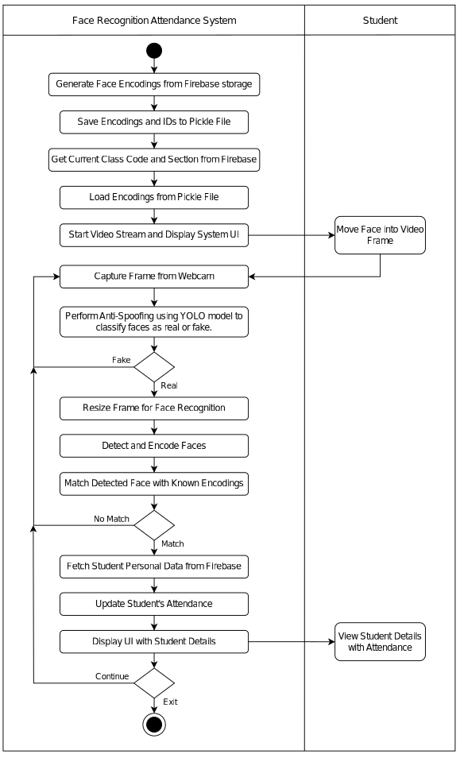
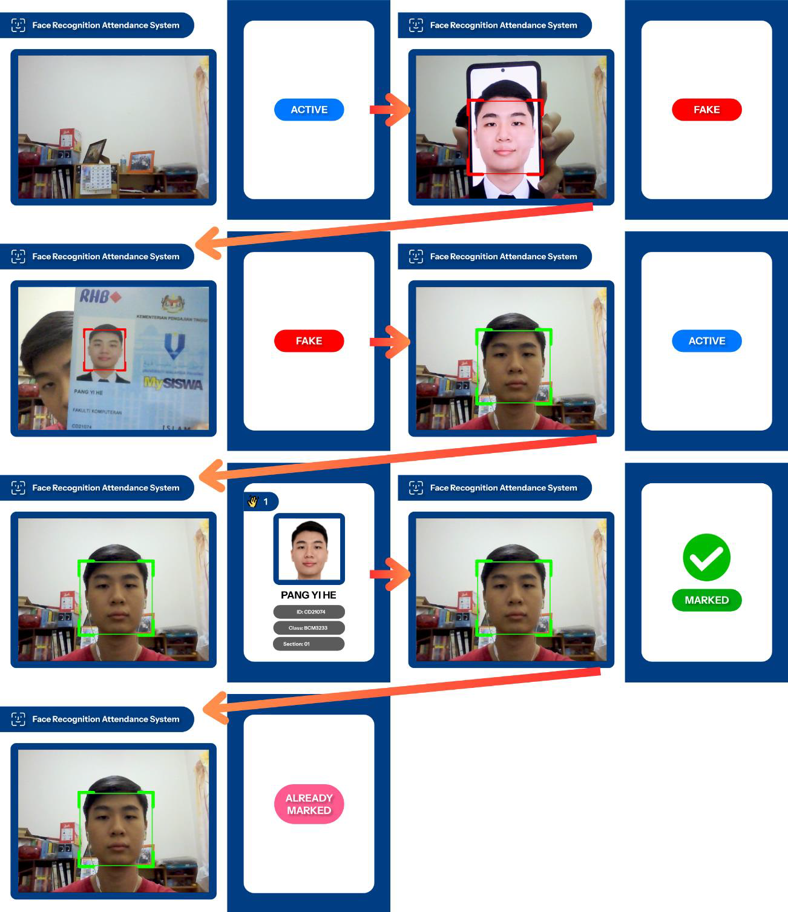
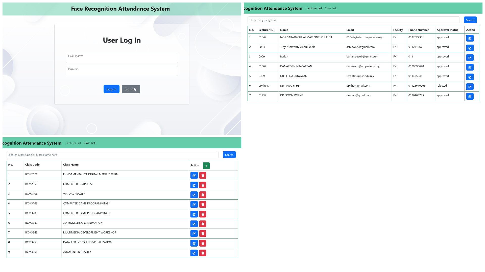
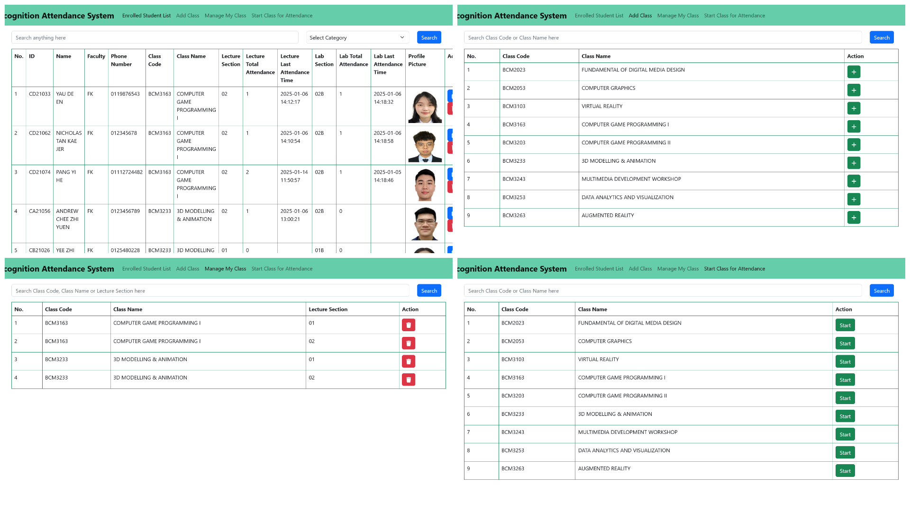
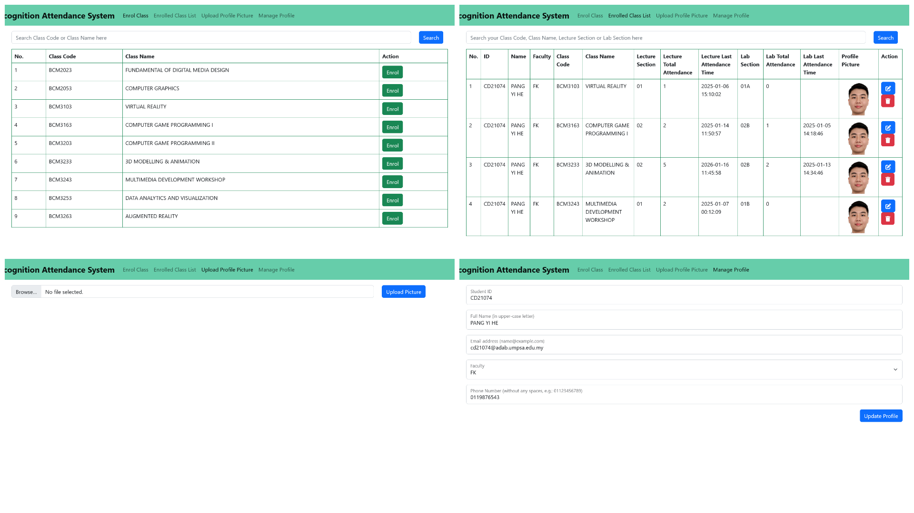

# Face Recognition Attendance System with Anti-Spoofing

A final year project that implements a secure, AI-powered student attendance system using face recognition combined with anti-spoofing detection to prevent fraudulent check-ins.

## Overview

This system is designed for academic institutions to automate attendance tracking while ensuring accurate identity verification. It integrates computer vision, deep learning, and web technologies to deliver a complete end-to-end solution.

## Features

- Real-time Face Detection & Recognition
- Anti-Spoofing Detection (prevents photo attacks)
- System User Interface (UI)
- Face Recognition Attendance System Website (Admin, Lecturer, and Student user types)
- CRUD Operations for Class, Enrollment, Attendance Records, and Account Management
- Cloud Database Integration (Firebase)

## Tech Stack

Backend (Python, OpenCV, face_recognition, Ultralytics)
Frontend (HTML, JavaScript, Bootstrap)
Database & Auth (Firebase Realtime Database, Firebase Authentication)

## System Architecture

### Website
Administrator:

Lecturer:

Student:

## YOLOv8 Anti-Spoofing Model

- Custom dataset collected for real vs spoof faces
- Data preprocessing and splitting (train/validation/testing)
- Model trained using Ultralytics YOLOv8
- Integrated into face recognition system for live spoof detection