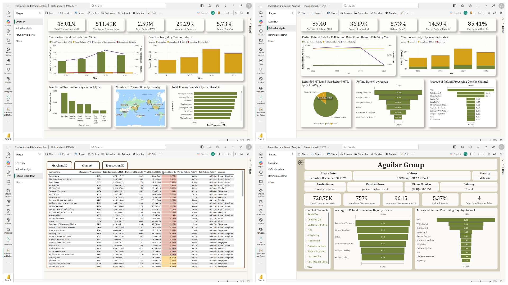

# Transaction and Refund Data Engineering & Automation Project

## Overview
This project demonstrates an end-to-end data workflow including data generation, ETL processing, automation, and business intelligence reporting.

It simulates a payment system environment and builds automated reporting pipelines for transaction and refund analytics.

## Project Components

### 1. Data Generation (Seeder Bot)
- Built using Python
- Generates realistic merchant profiles, transactions, transaction details, and refund data
- Designed for testing and analytics simulation

### 2. ETL Pipeline (Python)
- Extracts data from CSV files
- Transforms data (aggregation, currency normalization)
- Loads processed data into a SQLite database
- Produces weekly summarized transaction data and report

### 3. Report Automation (PHP)
- Queries database using SQL
- Generates daily top-merchant sales Excel reports
- Automates email delivery using SMTP

### 4. Business Intelligence Dashboard
- Developed interactive Power BI report
- Includes:
  - Metric cards
  - Transaction and refund analysis
  - Refund rate and processing time analysis
  - Merchant drill-down
  - Refund breakdown by merchant, transaction channel, and each transaction
- Uses advanced DAX for calculations and ranking

## Purpose
This project demonstrates skills in:
- Data Engineering (ETL)
- Automation
- Database management
- Business Intelligence
- Financial data analysis